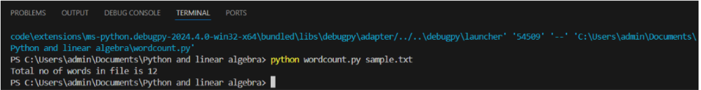

# Command--line-arguments-to-count-word
## AIM:
To write a python program for getting the word count from the contents of a file using command line arguments.
## EQUIPEMENT'S REQUIRED: 
PC
Anaconda - Python 3.7
## ALGORITHM: 
### Step 1:
Import numpy as np

### Step 2:
Enter the input values

### Step 3:
Write python program for getting the word count from the contents of a file using command line arguments

### Step 4:
Run the program

### Step 5:
Input the values

### Step 6:
End the program

## PROGRAM:
```
#DEVELOPED BY : Sarish Varshan V
#REGISTER NUMBER: 212223230196
import sys
fp=open(sys.argv[1])
wordcount=0
for i in fp:
    words=i.split()
    wordcount+=len(words)
print("Total no of words in file is",wordcount)
fp.close()
```

### OUTPUT:



## RESULT:
Thus the program is written to find the word count from the contents of a file using command line arguments.
